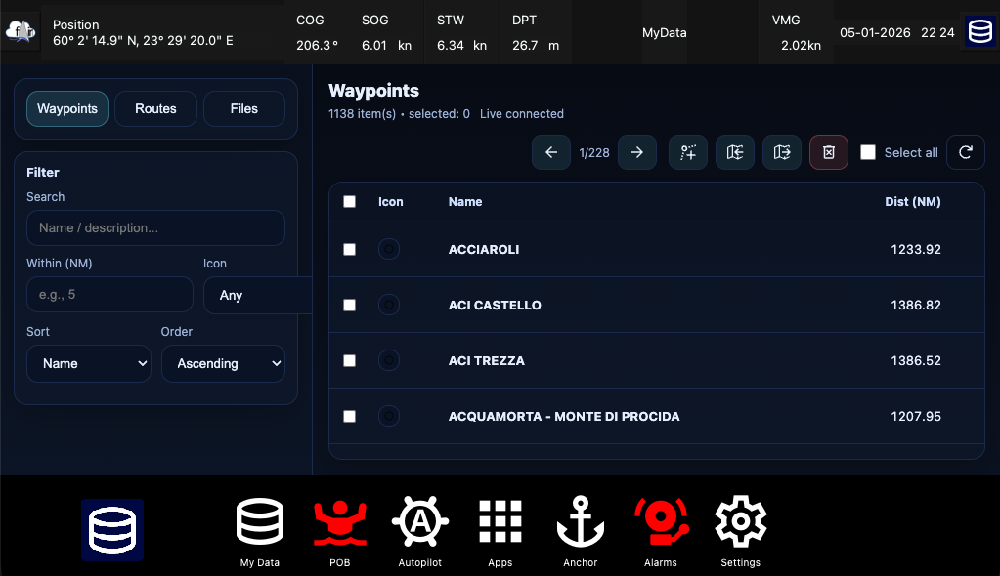
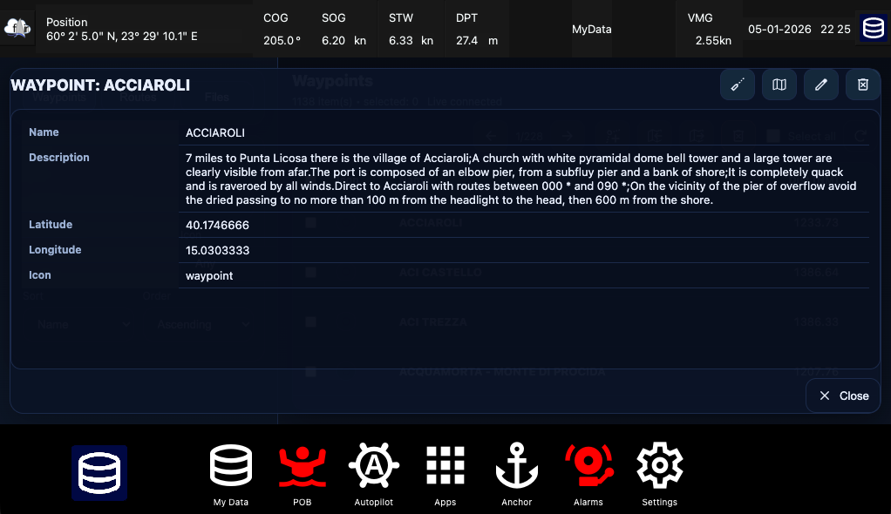
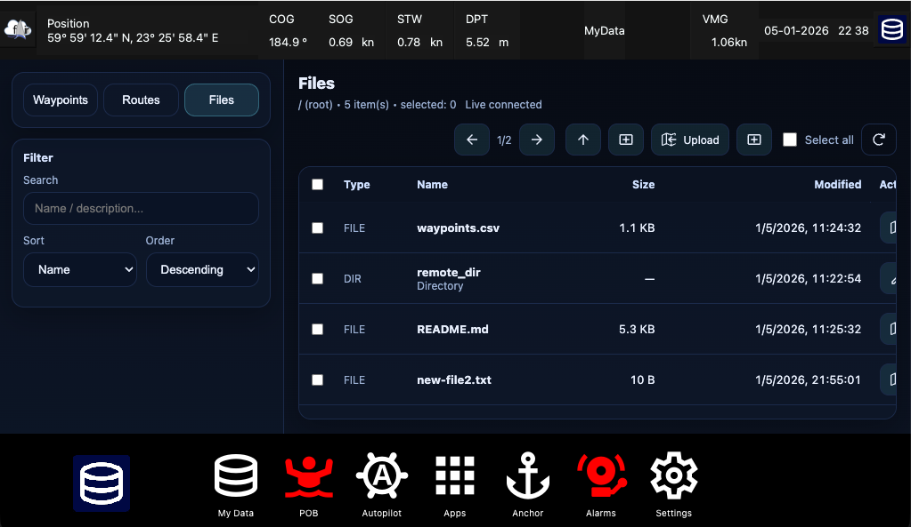

# Signal K Webapp: MyData (Waypoints / Routes / Files)

A **Signal K Node Server** plugin that provides a lightweight webapp to browse and manage:

- **Waypoints** (distance + bearing from vessel position, **GoTo** button)
- **Routes**
- **Files**

Features:
- Waypoint **distance / bearing** (computed from `vessels.self.navigation.position`)
- **GoTo** (publishes `navigation.courseRhumbline.nextPoint.*` with href per Signal K spec)
- **Show on map** (publishes best-effort GeoJSON `plugins.nav-manager.selectedFeature`)
- **Edit** & **Delete** waypoints
- Advanced **sorting** and **filtering**
- Waypoint icon selection (OpenBridge icons)
- Files area for browsing a configurable server-side root:
  - create folders, upload/download files, inline previews for text and common binary MIME types (images, audio, video, PDF)
  - server-side creation, editing, renaming, and deletion with text + image editors
- Import/Export **CSV**, **GPX**, **KML**, **geoJSON**

## Install

From Signal K Node Server UI:
1. Server → Plugin Config → **Get**
2. Search: `signalk-mydata-plugin`
3. Install and enable

## Open

Default mount path: `/signalk-mydata-plugin`

## Documentation

- [Getting started](./docs/getting_started.md)
- [Configuration](./docs/configure.md)
- [FairWindSK integration](./docs/fairwindsk_integration.md)

## Screenshots

## License

Apache 2.0 — see [LICENSE](./LICENSE)
